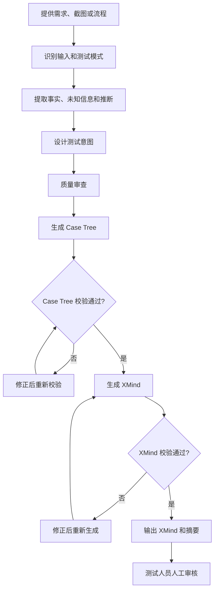

# 使用 Codex 生成测试用例与 XMind

> 当前项目提供了 `xmind-testcase` Skill，可以把需求、页面说明或截图转换为经过校验的 XMind 测试用例。

## 1. Skill 能做什么

Skill 目录：

```text
D:\VSCode\XmindCases\xmind-testcase
```

适合输入：

- 业务需求或功能说明；
- 单页面截图；
- 多页面截图和业务流程；
- 已有 Case Tree。

它会先分析事实和测试风险，再生成 Case Tree 和 `.xmind` 文件，不是简单的文字转思维导图。

## 2. 最简单的使用方法

在 VS Code 或 Codex CLI 中打开项目，然后调用 `$xmind-testcase`：

```text
使用 $xmind-testcase，根据 requirements/order-delete.md
生成 MES 订单删除测试用例。

要求：
- coverage_level 使用 standard；
- 覆盖正常、异常、权限、状态和数据一致性；
- 不得虚构需求中没有说明的业务规则；
- 推断场景必须记录 assumptions；
- 输出到 AI_Xmind/output/MES订单删除测试用例.xmind；
- 校验 Case Tree 和 XMind；
- 不修改其他无关文件。
```

如果没有需求文件，可以直接粘贴需求或附加截图。

## 3. 完整执行过程



默认行为：

| 配置 | 默认值 |
| --- | --- |
| 覆盖等级 | `standard` |
| XMind 格式 | `modern-json` |
| 测试模式 | 自动判断 `single_page` 或 `cross_page` |
| 文件覆盖 | 默认不覆盖已有文件 |

## 4. Skill 如何分析

信息优先级：

```text
用户明确描述
↓
需求明确内容
↓
截图可见事实
↓
页面语义推断
↓
通用测试风险推断
```

每条用例会标记来源：

| 来源 | 含义 |
| --- | --- |
| `described` | 用户或需求明确说明 |
| `visible` | 截图中清晰可见 |
| `inferred` | 根据测试风险推导 |

`inferred` 必须包含 `assumptions`。需求缺失或来源冲突会记录为 assumptions 或 warnings，不应被写成确定规则。

分析时会先形成“测试意图”，例如订单删除需要验证：

- 满足权限和状态时可以删除；
- 不满足状态时删除被拒绝；
- 无权限用户不能完成删除；
- 取消确认后订单保持不变；
- 删除后列表和查询结果一致；
- 重复或并发操作是否需要验证。

之后再把测试意图展开为包含前置条件、数据、步骤和预期结果的 Case Tree。

## 5. 中途会运行什么

Skill 主要使用以下脚本：

| 脚本 | 作用 |
| --- | --- |
| `validate_input.py` | 校验结构化输入，普通需求不一定运行 |
| `validate_case_tree.py` | 校验 Case Tree |
| `create_xmind.py` | 根据 Case Tree 生成 XMind |
| `validate_xmind.py` | 校验 XMind 文件结构 |

典型顺序：

```powershell
python scripts/validate_case_tree.py case_tree.json --json
python scripts/create_xmind.py case_tree.json output.xmind --summary output.summary.json
python scripts/validate_xmind.py output.xmind --json
```

测试人员主要关注：命令是否成功、输出路径是否正确、是否出现 warnings。

## 6. 先分析还是直接生成

需求清楚时，可以让 Skill 一次完成分析、生成和校验。

需求不完整或业务风险较高时，建议先审核：

```text
使用 $xmind-testcase 分析 requirements/order-delete.md。

第一阶段只输出：
- 已确认事实；
- 主要测试意图；
- assumptions；
- warnings。

不要生成文件。我确认后再生成 XMind。
```

## 7. MES 订单删除示例

错误 Prompt：

```text
帮我写订单删除测试用例。
```

这种写法没有需求依据、覆盖范围和输出要求。建议使用下面的完整 Prompt：

```text
使用 $xmind-testcase，根据以下需求生成并校验 XMind 测试用例。

【功能】MES 订单删除

【需求】
- 订单只有满足特定状态时才允许删除；
- 用户需要具备删除权限；
- 删除前需要确认；
- 删除成功后刷新列表；
- 删除后不能再次查询到该订单；
- 相关数据需要保持一致。

【要求】
- 采用 standard 覆盖等级；
- 覆盖正常、异常、权限、状态、取消确认、数据一致性和重复操作；
- 未说明具体状态和关联数据范围，不得自行补充；
- 推断场景标记为 inferred，并填写 assumptions；
- 输出到 AI_Xmind/output/MES订单删除测试用例.xmind；
- 生成后校验 Case Tree 和 XMind；
- 已有文件不得覆盖。
```

如果团队还需要 Markdown 评审稿，可在 Prompt 中增加：

```text
同时输出一份 Markdown 测试用例，按“场景 → 用例 → 前置条件、步骤、预期”组织。
```

Skill 生成 XMind 的主链路仍是 `测试意图 → Case Tree → XMind`，Markdown 是可选产物。

## 8. 输出结果怎么看

任务完成后，Codex 应报告：

- XMind 文件路径；
- 用例数量和 Sheet 数量；
- 覆盖等级和测试模式；
- 推断用例数量；
- 关键 assumptions 或 warnings；
- Case Tree 和 XMind 校验结果。

示例：

```text
XMind：AI_Xmind/output/MES订单删除测试用例.xmind
用例：18 条，1 个 Sheet
覆盖等级：standard
推断用例：4 条
Case Tree 校验：通过
XMind 校验：通过
Warnings：允许删除状态和关联数据范围待确认
```

## 9. 人工审核重点

- 业务规则是否有需求依据；
- `described`、`visible`、`inferred` 是否正确；
- 每条推断用例是否有 assumptions；
- 是否虚构状态、权限、字段、限制或提示；
- 步骤是否可执行，预期是否可观察；
- 是否有重复用例或遗漏主流程；
- warnings 是否已经跟进确认。

校验通过只代表文件结构正确，不代表业务内容已经正确。

## 10. 总结

```text
需求或截图
↓
调用 $xmind-testcase
↓
事实与风险分析
↓
测试意图
↓
Case Tree 生成与校验
↓
XMind 生成与校验
↓
人工审核
↓
正式测试用例
```

> Skill 负责生成可校验的 XMind 初稿，测试人员负责确认业务和最终质量。
